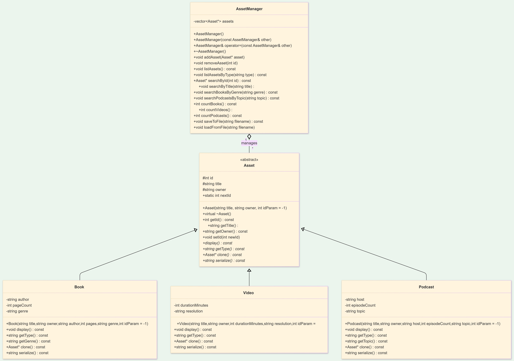

# 📦 Dijital Varlık Yönetim Sistemi (Asset Management System)

Bu proje, farklı tiplerdeki dijital varlıkların (Kitap, Video, Podcast) ortak bir yapı altında modellendiği, C++ ile geliştirilmiş konsol tabanlı bir yönetim sistemidir. 

Sistem; nesne yönelimli programlama (OOP) prensiplerini, dinamik bellek yönetimini ve dosya giriş/çıkış (I/O) işlemlerini güvenli bir mimaride birleştirmeyi amaçlamaktadır.

## 📐 UML Sınıf Diyagramı
*(Sistemin genel mimarisini, kalıtım ve kompozisyon ilişkilerini aşağıda görebilirsiniz.)*



## 🚀 Temel Özellikler
* **CRUD İşlemleri:** Yeni varlık ekleme, silme ve dinamik listeleme.
* **Polimorfik Arama:** ID'ye, başlığa, türe (Kitaplar için Genre) veya konuya (Podcastler için Topic) göre dinamik arama ve filtreleme.
* **Veri Kalıcılığı (File I/O):** `.txt` dosyalarından toplu veri yükleme (Batch Loading) ve mevcut durumu dosyaya kaydetme.
* **Çakışma Yönetimi:** Dosyadan okunan verilerdeki ID çakışmalarını önleyen "On-the-fly ID Reassignment" (Anlık ID yeniden atama) ve senkronizasyon mekanizması.
* **Güvenli Kullanıcı Girdisi (Input Validation):** Hatalı veri girişlerinde programın çökmesini veya sonsuz döngüye girmesini engelleyen girdi tamponu (buffer) kontrolleri.

## 💻 Kullanılan OOP ve Yazılım Mühendisliği Prensipleri
Projenin temel mimarisinde aşağıdaki kavramlar titizlikle uygulanmıştır:

1. **Kalıtım (Inheritance) & Soyutlama (Abstraction):** Ortak özellikler (ID, Title, Owner) soyut (abstract) bir `Asset` taban sınıfında toplanmış, spesifik özellikler ise `Book`, `Video` ve `Podcast` alt sınıflarına miras bırakılmıştır.
2. **Dinamik Polimorfizm (Dynamic Polymorphism):** `virtual` fonksiyonlar ve RTTI (Run-Time Type Information) destekli `dynamic_cast` kullanılarak çalışma zamanında tip güvenli işlemler gerçekleştirilmiştir.
3. **Bellek Yönetimi (Memory Management):** Sınıf içerisinde dinamik bellek tahsisi kullanıldığı için **"Rule of Three"** (Copy Constructor, Assignment Operator, Destructor) kuralları uygulanmıştır. `AssetManager` nesneleri arasında adres çakışmasını önlemek için `clone()` metodu ile **Derin Kopyalama (Deep Copy)** mekanizması kurulmuştur.
4. **DRY Prensibi:** Tekrarlayan kod blokları önlenmiş, listeleme ve arama gibi işlemler merkezi yardımcı fonksiyonlar (helper functions) üzerinden yürütülmüştür.

## 📂 Proje Yapısı

```text
├── Asset.h / Asset.cpp         # Soyut taban sınıf tanımlamaları
├── Book.h / Video.h / Podcast.h # Asset'ten türetilmiş alt sınıflar
├── AssetManager.h / .cpp       # Varlık havuzunu ve iş mantığını yöneten sınıf
├── main.cpp                    # Kullanıcı arayüzü ve menü döngüsü
├── assets.txt                  # Örnek serileştirilmiş veri dosyası
└── input1.txt / input2.txt     # Test için kullanılan girdi dosyaları
